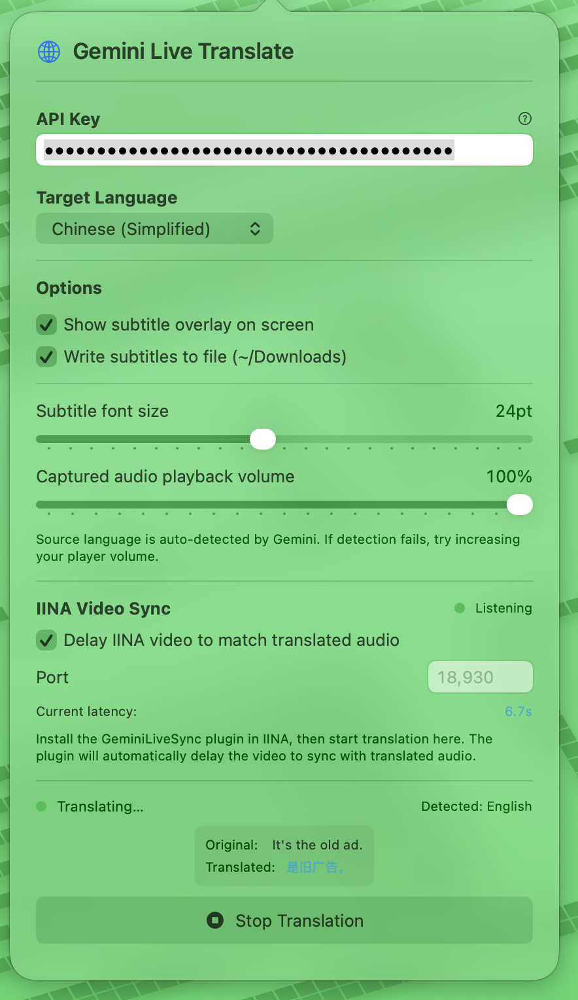
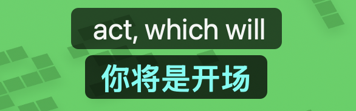

# GeminiLiveTranslate

A simple and lightweight real-time live translation overlay for video players, powered by Google's Gemini 3.5 Live Translate API.

**中文文档**: [README.zh.md](README.zh.md)

## Features

- **Live Audio Translation**: Translates system audio and video in real-time using Gemini Live Translate API, including web and local sources.
- **IINA Plugin Integration**: Automatic audio delay synchronization with IINA player
- **Smart Latency Tracking**: Per-utterance latency measurement with adaptive EMA smoothing
- **Adaptive FIFO Buffering**: Never drops audio bursts; smooth playback during pauses
- **Subtitle Export**: Option to save translated subtitles to file

## Requirements

- macOS 14 or later
- Internet connection
- [Google Gemini API key](https://aistudio.google.com/apikey) (free tier available for Gemini 3.5 Live Translate)
- (Optional) IINA player for subtitle overlay and delay sync

## Installation

### From Release

1. Download the latest release from [Releases](https://github.com/cskeleton/GeminiLiveTranslate/releases)
2. Extract the archive:
   ```bash
   tar -xzf GeminiLiveTranslate-macos.tar.gz
   ```
3. Copy the executable:
   ```bash
   cp dist/GeminiLiveTranslate ~/.local/bin/
   ```
4. (Optional) Install IINA plugin:
   ```bash
   mkdir -p ~/.config/iina/plugins/
   cp -r dist/GeminiLiveSync.iinaplugin ~/.config/iina/plugins/
   ```

### From Source

1. Clone the repository:
   ```bash
   git clone https://github.com/cskeleton/GeminiLiveTranslate.git
   cd GeminiLiveTranslate
   ```
2. Build with Swift:
   ```bash
   swift build -c release
   ```
3. Run:
   ```bash
   .build/release/GeminiLiveTranslate
   ```

## Configuration

1. Launch the application
2. Enter your Gemini API key in Settings (get one free at [Google AI Studio](https://aistudio.google.com/apikey))
3. Select target language for translation
4. (Optional) Enable IINA sync if using the player
5. Click "Start Translation"

## Screenshots

### Application Interface


### Subtitle Overlay


## Architecture

### Core Components

- **AudioPlayer**: FIFO jitter buffer with adaptive AudioQueue management
- **LatencyTracker**: Per-utterance sampling anchored to Gemini's ASR stream
- **GeminiWebSocket**: Bidirectional WebSocket client for Gemini Live API
- **SystemAudioCapture**: ScreenCaptureKit audio extraction with format conversion
- **WebSocketServer**: Local HTTP/WebSocket server for IINA plugin sync

### Latency Measurement

Speech onsets are anchored to Gemini's `inputTranscription` events (server-side ASR is language-aware), not local energy detection. When the first translated audio chunk arrives, the sample is:

```
latency = (now - utterance_start) + queued_playback_duration
```

This is smoothed with adaptive EMA (α=0.3 for >1s changes, α=0.1 for smaller ones) and published once per utterance, eliminating the startup surge and mid-burst noise from per-chunk updates.

## IINA Plugin

The `GeminiLiveSync.iinaplugin` automatically:
- Monitors video pause/resume and notifies the translator
- Detects seek events and flushes stale audio
- Polls latency from the translator and applies `audio-delay` to sync video
- Uses hysteresis (≥0.4s change threshold, ≥5s between adjustments) to reduce stuttering

## Known Limitations

- Works with system audio only (not application-specific audio)
- Latency estimates stabilize over the first few utterances
- If dialogue has no 2-second pauses, per-utterance sampling may be delayed
- IINA plugin requires manual load after installation

## Development

### Building

```bash
swift build -c release
```

### Running Tests

```bash
swift test
```

### Code Structure

```
Sources/GeminiLiveTranslate/
├── AudioPlayer.swift         # Audio playback and buffering
├── LatencyTracker.swift       # Latency measurement and EMA
├── GeminiWebSocket.swift      # Gemini API client
├── SystemAudioCapture.swift   # System audio capture
├── TranslationEngine.swift    # Main orchestration
├── WebSocketServer.swift      # IINA plugin HTTP/WebSocket server
├── AppState.swift             # SwiftUI state management
├── SettingsView.swift         # Settings UI
├── SubtitleOverlayWindow.swift # Subtitle display window
└── main.swift                 # Entry point
```

## License

MIT

## Credits

- Google Gemini Live Translate API
- IINA media player
- ScreenCaptureKit for audio capture
